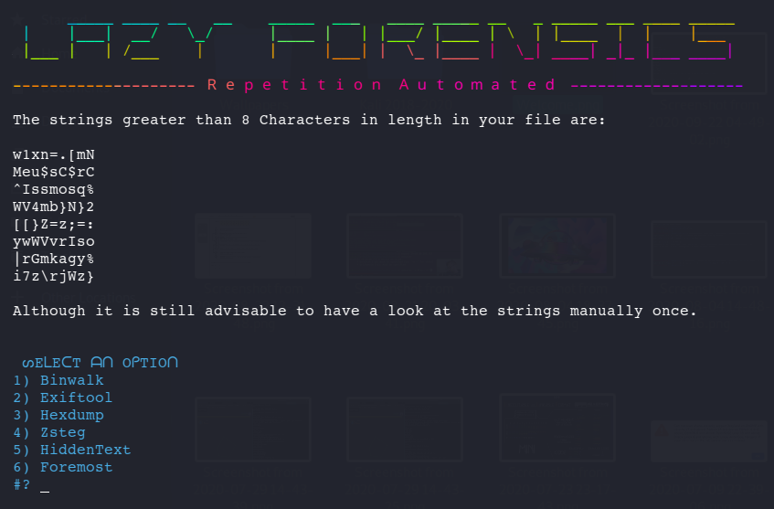

# Lazy-Forensics
A bash script to automate repetition while solving Forensic Challenges in a CTF.

## Usage
>• Clone the repository.  
>• For instructions go through the Usage-Readme.txt file.  
>• Run the setup.sh as sudo for installing all requirements.  
>• Execute the run.sh program with file name to use the tool.  

### IMPORTANT
Follow the instructions in Usage-Readme.txt to run the tool properly.  

## Working Demo

