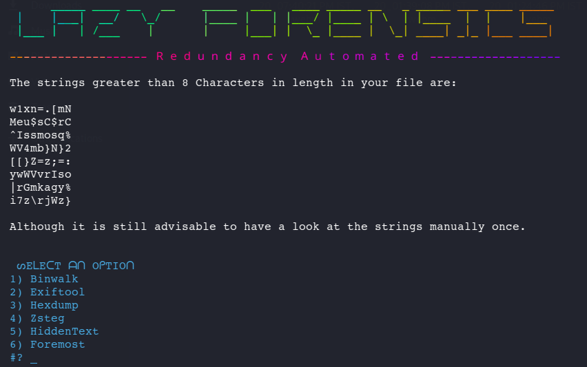

# Lazy-Forensics
A bash script to automate redundancy while solving Forensic Challenges in a CTF.

## Usage
>• Clone the repository.
>• For instructions go through the Usage-Readme.txt file. (IMPORTANT)
>• Run the setup.sh as sudo for installing all requirements.
>• Execute the run.sh program to use the tool.

