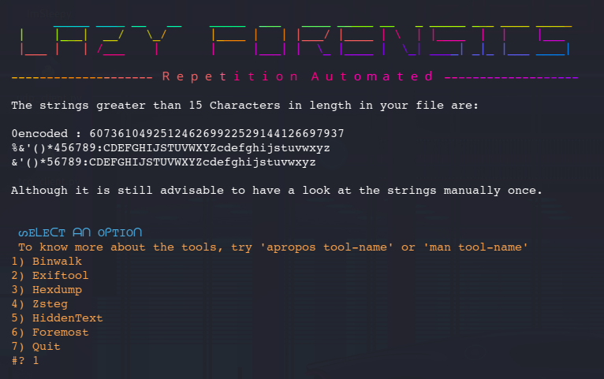

# Lazy-Forensics

### A bash script to automate repetition of similar tasks and save time while analysing Forensic Challenges in a CTF.

## Instructions
Follow the instructions in Usage-Readme.txt to run the tool properly.  

## Working
 • Run the script with parameters as **$0 - run.sh**, **$1 - Filename.xyz** and **$2 - Min Length** of the strings to output from the file. 
 • After setting up all the requirements, execute the run.sh program with files(preferably JPEG, JPG, PNG, BMP, TXT, etc).  
 • The output of the script is stored in a log.txt file so as to save time and repetition while analyzing a file.  
 • Some of the tools used come pre-installed with OS's like Kali Linux or Parrot, while other distros of Linux are required to install them. 

## Working Demo

